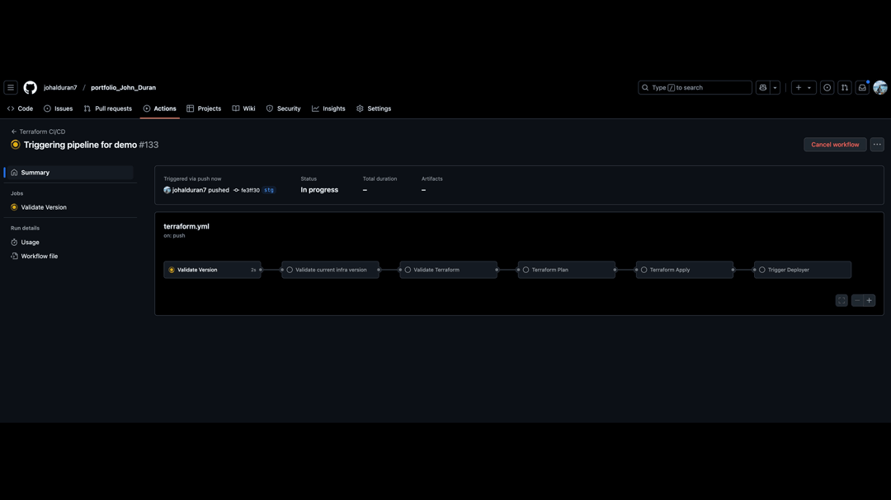
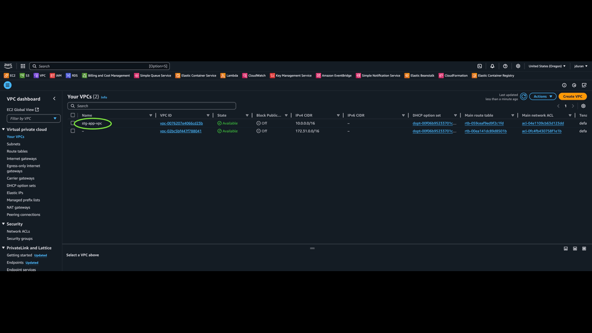

# Infrastructure and Deployment Automation

## Overview
This repository automates the provisioning and deployment of a Node.js application on AWS using Terraform and GitHub Actions.

### Repository Structure
- **Terraform Pipeline** (`.github/workflow/terraform.yml`)
- **Deployer Pipeline** (`.github/workflow/deployer.yml`)
- **Infrastructure Code** (`./app/terraform/`)
- **Application Code** (`./app/src/`)

---
## Demo

### Creating branch, configuring .env, and triggering the pipelines

### Running Infrastructure and Application pipelines

### Checking deployment on AWS

## Terraform Pipeline (Infrastructure Provisioning)
**Triggers:**
- Runs whenever the infrastructure version file (`./app/terraform/infra_version.txt`) is updated.

**Provisions the following AWS resources:**
- **Networking:** VPC, Subnets, Route Tables, Internet Gateway
- **Compute & Scaling:**
  - Application Load Balancer (ALB), Target Groups, Listeners
  - Auto Scaling Group (ASG) with:
    - Launch Template
    - User Data to:
      - Install Docker and Apache
      - Pull and run the application image from ECR
      - Set up CloudWatch Unified Agent
- **Security:** Security Groups, IAM roles
- **Storage & Configuration:** ECR repository, CloudWatch, Parameter Store keys

**Additional Features:**
- **ASG Scaling Control:**
  - Desired, min, and max instance values are stored in AWS Systems Manager Parameter Store.
  - Terraform ignores changes to these values to prevent unintended modifications.
  - Only resets on full infrastructure destruction and re-creation.
- **Lifecycle Hook:**
  - Ensures ASG does not add new instances to the ALB until they are fully initialized.
  - Keeps instances in a pending state while setup completes.

**Trigger:** Calls the Deployer Pipeline upon successful provisioning.

---

## Deployer Pipeline (Application Deployment)
**Triggers:**
- Runs when:
  - The application version file (`./app/app_version.txt`) is updated with a new release tag.
  - Called by the Terraform pipeline after provisioning.

**Deployment Process:**
1. Validates if the specified tag exists in the repository.
2. Checks if the corresponding Docker image already exists in ECR:
   - If **exists**, updates Parameter Store value so the Launch Template User Data pulls the new version.
   - If **does not exist**, builds and pushes the image to ECR.
3. Builds a Docker image from `src/` using a pre-defined `Dockerfile` containing all necessary dependencies for the Node.js application.

---

## Future Improvements
- Enhance lifecycle management for better deployment flexibility.
- Improve monitoring and alerting within CloudWatch.
- Implement blue-green or rolling deployments for zero-downtime updates.

---

## How to Contribute
1. Fork the repository.
2. Create a new branch for your changes.
3. Submit a pull request with a clear description of improvements.

---

## License
This project is licensed under [MIT License](LICENSE).
