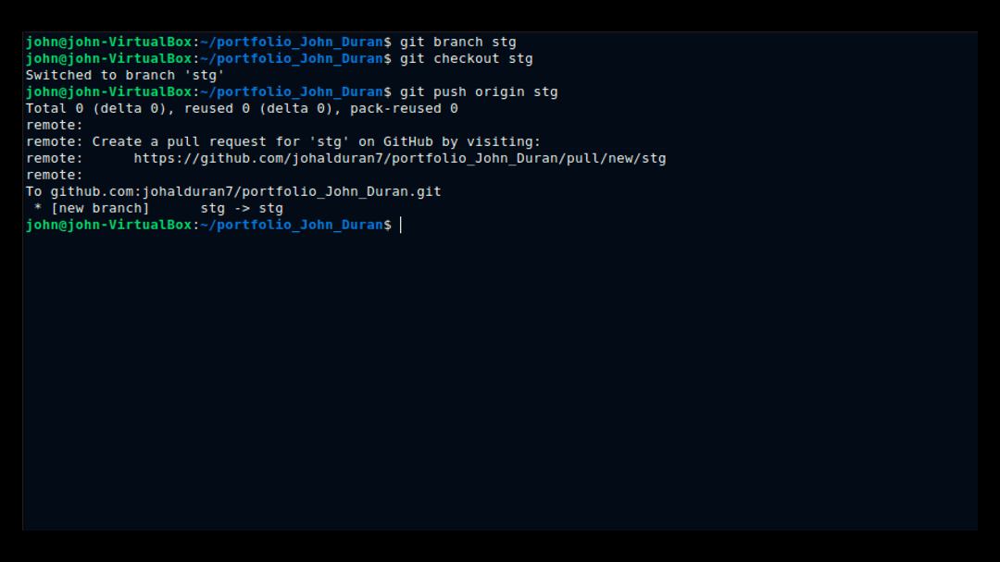

# AWS Infrastructure and Apache+NodeJs APP deployed via GitHub Actions.
Tools and features:
- Infrastructure deployed with Terraform
- Backend stored on Terraform Cloud
- GitHub Actions Workflow for pipeline
- Docker image stored on ECR
  
  
## Creating branch, configuring .env, and triggering pipeline

## Running Infrastructure and Application pipelines

## Checking deployment on AWS

